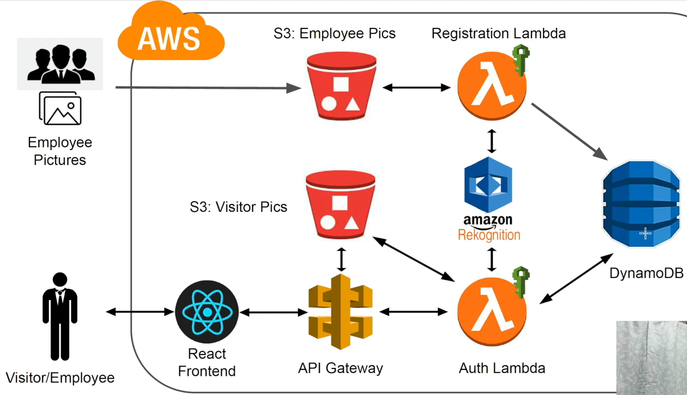

# Facial Recognition Application (using AWS)

This repository contains a facial recognition demo project that combines a small Python backend for employee registration/authentication and a React/Vite frontend app located in `facial-recognition-app`.

**Demo URL**: "http://facial-recognition-app-ui.s3-website-us-east-1.amazonaws.com"

**Quick Summary**
- **Backend**: Python scripts at the repository root (`employee_registration.py`, `employee_authentication.py`) that interact with your environment and AWS resources.
- **Frontend**: `facial-recognition-app` — a Vite-based React app (source in `facial-recognition-app/src`, static assets in `facial-recognition-app/public`).

**Repository Layout**
- `employee_registration.py` : To register an employee (face data, metadata).
- `employee_authentication.py` : To authenticate/verify an employee using face data.
- `facial-recognition-app/` : frontend (Vite + React) with `package.json`, `src/`, `public/`.
- `backups/facial-recognition-app.bundle` : backup bundle containing the original sub-repo history (kept for safekeeping).

**Prerequisites**
- Python 3.13+ installed locally.
- Node.js 22+ and npm (or yarn/pnpm) for the frontend.
- AWS credentials configured (if you plan to use AWS services such as S3, Rekognition, or DynamoDB).

If you plan to run the AWS-related parts, configure credentials with one of these common methods:
```bash
# recommended: configure via AWS CLI
aws configure
# or set environment variables
export AWS_ACCESS_KEY_ID="..."
export AWS_SECRET_ACCESS_KEY="..."
export AWS_DEFAULT_REGION="us-east-1"
```

# Facial Recognition App on AWS — from scratch



Facial recognition application built to run on AWS using serverless components. It includes Python scripts for registration and authentication as well as a Vite + React frontend inside `facial-recognition-app/`.

This README documents the architecture, the AWS services used (Rekognition, Lambda, DynamoDB, API Gateway, S3), local setup, deployment recommendations, and security/IAM guidance.

Key services and roles
- Amazon S3 — stores uploaded face images and optional frontend build artifacts; used as durable object storage for images and static assets.
- Amazon API Gateway — exposes HTTPS REST endpoints for the frontend to call; routes requests to Lambda functions.
- AWS Lambda — serverless compute for handling registration and authentication flows; performs preprocessing and orchestrates calls to Rekognition and DynamoDB.
- Amazon Rekognition — performs face detection and face comparisons (CompareFaces or FaceIndex/FaceSearch workflows) to verify identities.
- Amazon DynamoDB — stores metadata about employees (IDs, face references, timestamps, access logs).

Architecture overview
- User (browser / frontend) uploads images or initiates capture → images stored in S3 (or sent directly to API Gateway).
- Frontend calls API Gateway endpoints which invoke Lambda functions.
- Lambda functions process images (optional resize), call Rekognition to index/compare faces, and read/write user metadata to DynamoDB.
- Rekognition returns match scores; Lambda applies business logic (thresholds, confidence) and returns a response to the frontend.

Security and IAM
- Least privilege: create separate IAM roles for Lambda with only required permissions: S3 Get/Put for specific buckets, Rekognition:DetectFaces/IndexFaces/CompareFaces, DynamoDB PutItem/GetItem/Query for the specific table.
- Do not embed AWS credentials in code. Use environment variables or IAM roles (for Lambda).
- Use HTTPS (API Gateway) and CORS policies that only allow your frontend domain.

Local development

Prerequisites
- Python 3.13+ (for scripts)
- Node.js 22+ and npm/yarn (for frontend)
- AWS CLI configured with appropriate credentials (or localstack for offline testing)

Backend (Python) quickstart
1. Create and activate a virtual environment:
```bash
python -m venv .venv
source .venv/Scripts/activate  # on Windows PowerShell: .\\.venv\\Scripts\\Activate.ps1
```
2. Install dependencies (if you add a `requirements.txt` file):
```bash
pip install -r requirements.txt || pip install boto3
```
3. Run registration/auth samples (adjust for your usage):
```bash
python employee_registration.py
python employee_authentication.py
```

Frontend (Vite/React) quickstart
1. Install dependencies and start dev server:
```bash
cd facial-recognition-app
npm install
npm run dev
```
2. Build for production:
```bash
npm run build
```

Deployment guidance (high-level)
1. Provision resources (recommended): use IaC (CloudFormation / AWS SAM / Terraform). Resources to create:
	- S3 bucket (public/static or private with CloudFront)
	- DynamoDB table for users/metadata
	- Lambda functions (registration, authentication)
	- API Gateway REST API with routes mapped to Lambdas
	- IAM roles with least privilege for Lambdas
2. Configure Rekognition: either use image-based CompareFaces or IndexFaces + SearchFacesByImage (for larger scale).
3. Secure your endpoints: use API keys, IAM authorizers, or Cognito for authenticated flows.

Example IAM permissions (Lambda role) — minimal example
```
Action:   s3:GetObject, s3:PutObject       Resource: arn:aws:s3:::your-bucket/*
Action:   rekognition:CompareFaces         Resource: *
Action:   rekognition:IndexFaces           Resource: *
Action:   dynamodb:PutItem, dynamodb:GetItem, dynamodb:Query  Resource: arn:aws:dynamodb:REGION:ACCOUNT:table/YourTable
```

Notes on Rekognition workflows
- For small projects, CompareFaces is simple: provide a source/target image and Rekognition returns similarity scores.
- For production-scale, IndexFaces into a Rekognition collection and use SearchFacesByImage for quick lookups and scalable indexing.
- Face match thresholds are important — tune based on false positive/negative tolerance.

Troubleshooting
- Rekognition errors: check region compatibility and ensure Rekognition is enabled in that region.
- Permission errors: check the IAM role attached to Lambda for required actions (S3, Rekognition, DynamoDB).
- CORS: ensure API Gateway CORS is configured for your frontend origin.

Next steps / Improvements
- Add IaC (AWS SAM / CloudFormation / Terraform) templates to automate provisioning.
- Add authentication (Cognito) for secure user flows.
- Implement monitoring (CloudWatch logs, alarms) and audit logs for face verification operations.

Contributing
- Open issues and PRs are welcome. Document any new AWS resources and minimal IAM permissions required.

License
- Add a license file to indicate permissions (MIT, Apache-2.0, etc.).

Contact
- For questions, open an issue in this repo.
